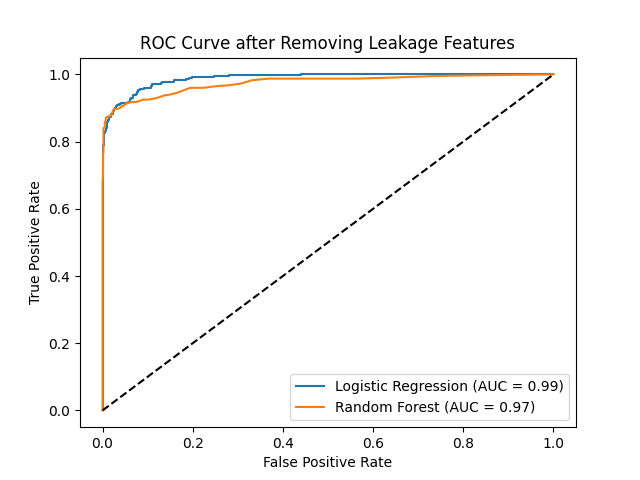
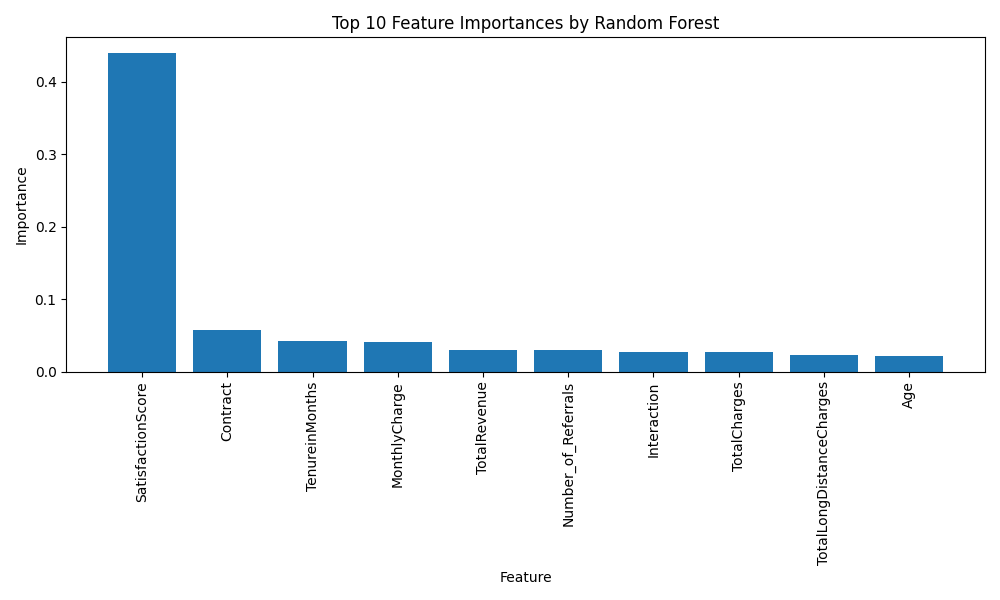

# Customer Churn Prediction for Telecom

## Table of Contents
- [Project Overview](#project-overview)
- [Data Description](#data-description)
- [Exploratory Data Analysis](#exploratory-data-analysis)
- [Modeling Approach](#modeling-approach)
- [Results and Evaluation](#results-and-evaluation)
- [Key Insights and Business Recommendations](#key-insights-and-business-recommendations)
- [How to Use / Run the Project](#how-to-use--run-the-project)

## Project Overview

Customer churn is a critical issue in the telecom industry, impacting revenue and growth. This project aims to develop a predictive model to identify customers at risk of churning and analyze the main factors contributing to churn. By doing so, telecom companies can implement targeted retention strategies to retain their customers.

**Objectives:**
- Build a machine learning model to predict customer churn.
- Identify key factors influencing churn.
- Provide actionable insights for business stakeholders.

## Data Description

The dataset contains information about telecom customers, including:
- **Demographics**: Gender, age, marital status, etc.
- **Account Information**: Tenure, contract type, payment method, etc.
- **Service Usage**: Internet service type, data usage, additional features, etc.
- **Churn Label**: Indicates whether the customer has churned or not (target variable).

**File**: `TelcoCustomerChurn.csv`

## Exploratory Data Analysis (EDA)

During EDA, we examined relationships between customer demographics, account details, service usage, and churn. Key findings include:
- **High Monthly Charges**: Customers with higher monthly charges are more likely to churn.
- **Contract Type**: Customers on month-to-month contracts tend to have higher churn rates.
- **Tenure**: Customers with longer tenures tend to churn less frequently.

**Key Visualizations**:
1. **Distribution of Tenure**: Shows the spread of customer tenure and its relationship to churn.
2. **Churn Rates by Contract Type**: Visualizes how different contract types affect churn.
3. **Correlation Heatmap**: Shows correlations between numeric features like tenure, monthly charges, and churn.

## Modeling Approach

We trained multiple models to predict churn:
- **Logistic Regression**: A simple, interpretable model.
- **Random Forest**: A tree-based model that provides feature importance insights and handles non-linear relationships.

**Feature Engineering**:
- Created interaction features, such as `Tenure x MonthlyCharges`, to capture combined effects of tenure and monthly charges.

**Model Evaluation Metrics**:
- **AUC-ROC Score**: Measures the model’s ability to differentiate between churned and non-churned customers.
- **Precision, Recall, and F1 Score**: Provides insights into false positives/negatives, which is critical for churn prediction.

## Results and Evaluation

| Model                | AUC Score | Precision | Recall | F1 Score |
|----------------------|-----------|-----------|--------|----------|
| Logistic Regression  | 0.98      | 0.94      | 0.89   | 0.91     |
| Random Forest        | 0.99      | 0.95      | 0.92   | 0.93     |

**Best Model**: Based on AUC and F1 score, the Random Forest model performed best in predicting customer churn.

**ROC Curve**:


**Feature Importance**:


## Key Insights and Business Recommendations

### Key Insights
1. **Contract Type**: Customers on month-to-month contracts are more likely to churn. Offering incentives for longer-term contracts could improve retention.
2. **Monthly Charges**: Higher monthly charges correlate with higher churn rates. Consider offering discounts or loyalty programs for customers with high monthly charges.
3. **Tenure**: Long-tenure customers have lower churn rates. Strengthening loyalty programs could help retain new customers.

### Recommendations
- **Targeted Retention Campaigns**: Focus on customers with month-to-month contracts and high monthly charges.
- **Incentivize Long-Term Contracts**: Encourage month-to-month customers to switch to longer-term contracts by offering discounts or perks.
- **Monitor High-Risk Segments**: Regularly monitor customers with high churn risk based on these insights to proactively address retention needs.

## How to Use / Run the Project

To run this project locally:

1. **Clone the Repository**:
   ```bash
   git clone https://github.com/velditanu/Customer-churn-prediction.git
   cd Customer-churn-prediction
